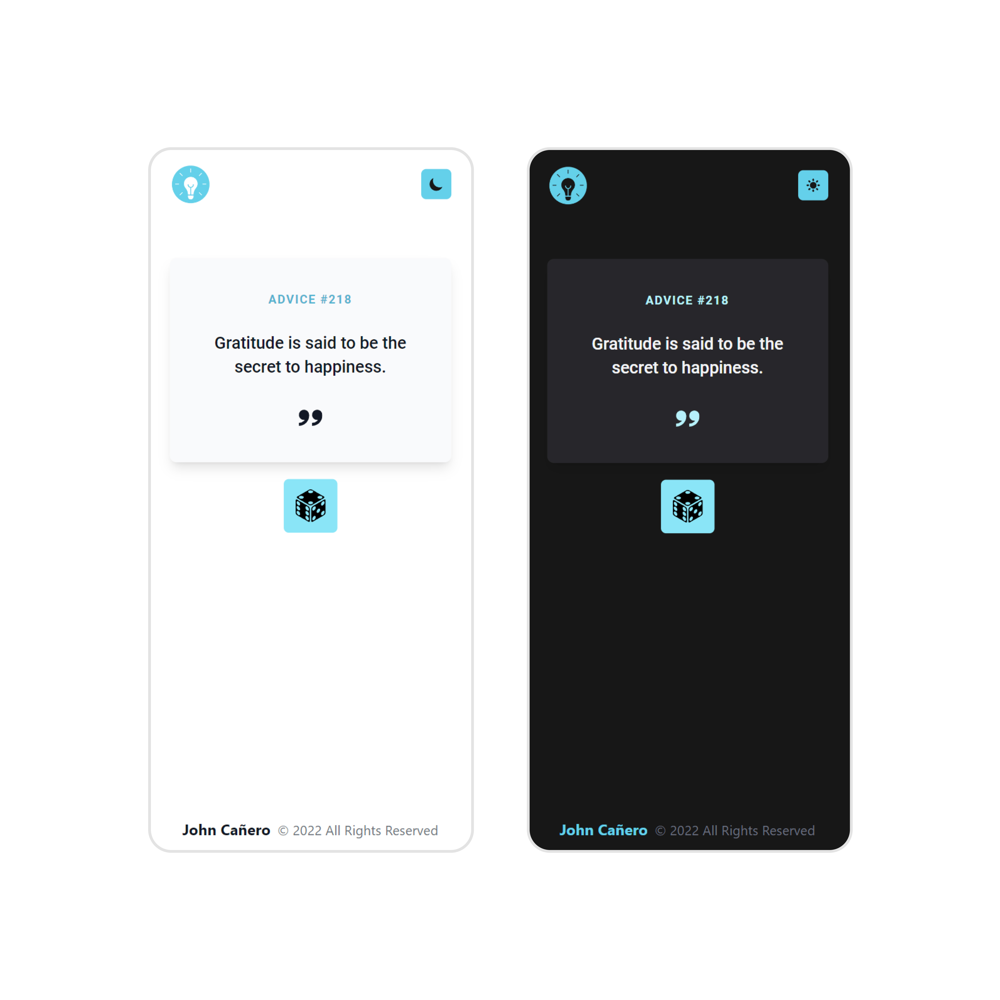

<!-- markdownlint-configure-file {
  "MD013": {
    "code_blocks": false,
    "tables": false
  },
  "MD033": false,
  "MD041": false
} -->

  

# Advice Generator App

This is the Advice Generator Application. The perfect project if you're learning
how to interact with 3rd-party APIs. This challenge uses the Advice Slip API to
generate random quotes of advice.

Let's be inspired, motivated and bless ourselves with quotes that would help and
improve our life for the better and for others.

## Website

🖥️ [https://advice-generator-app-by-johncanero.vercel.app/]

✍️ Project by John Cañero

## Responsive Design

🪟: [Desktop - Tablet - Mobile]

Desktop Responsive Light
<!-- 
Desktop Responsive Dark

Tablet Responsive | Light and Dark
 -->
Mobile Responsive | Light and Dark

